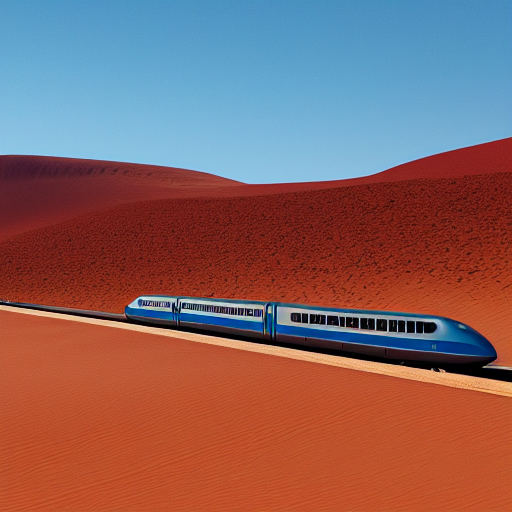
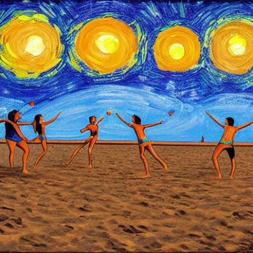
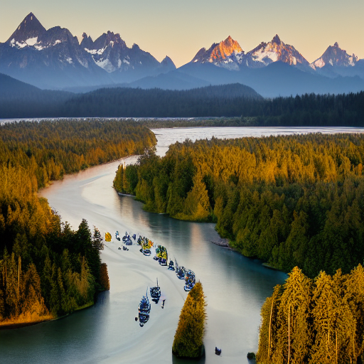
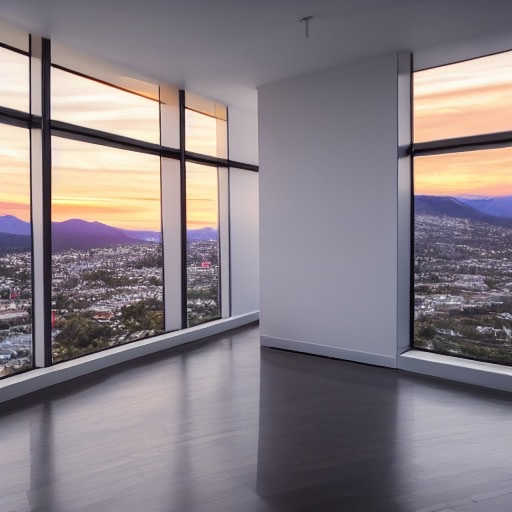
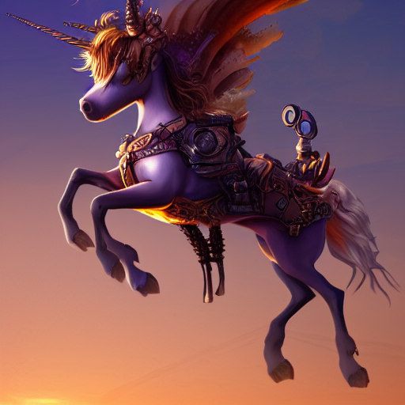
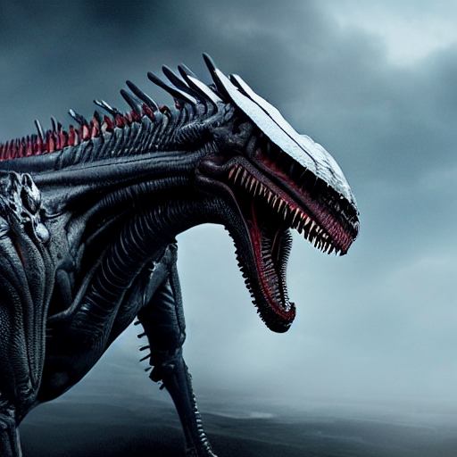
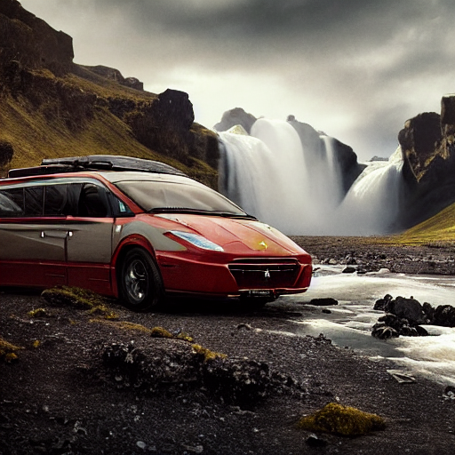
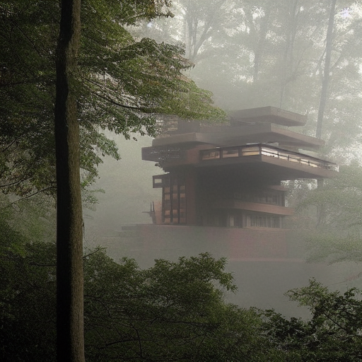

> Maglev train through the Sahara Desert, 4k photograph

> people playing beach volleylball at night, painting in the style of Starry Night

> solarpunk utopia in the Hoh rainfirest, mountain sunset in the background, river filled with sailboat in the foreground, 4k photography

> loaf of sourdough bread on a sunny beach, 4k photography

> corner office, floor to ceiling windows in a highrise apartment, sunset over the mountains, 4k photography

> A steampunk unicorn riding in the sunset, artstation concept art

> Photo of Xenomorph Drogon in game of thrones hybrid. High detail, photorealistic, trending on deviantArt, raytraced

> kitten taking an afternoon nap in sun-lit sunflower. High detail, photorealistic, 8k blender render

> ferrari minivan driving past mountains in Iceland, waterfalls in background, mad max post apocalyptic lighting, intricate, elegant, highly detailed, photorealistic, digital painting, artstation, concept art, smooth, sharp focus, illustration, octane render, unreal engine

> tree house, frank lloyd wright, architecture, streaks of light, misty fog

> Fantasy art, octane render, 16k, underwater, coral reef, with aqua water, silver Guggenheim museum spire, rays of sunshine, tall building, zaha hadid and Santiago calatrava, schools of tropical fish,3d cgi, high definition, bright lighting

All of these images were generated using either [this Google Colab](https://colab.research.google.com/drive/1zVTa4mLeM_w44WaFwl7utTaa6JcaH1zK) or [this hugging face space](https://huggingface.co/spaces/stabilityai/stable-diffusion)